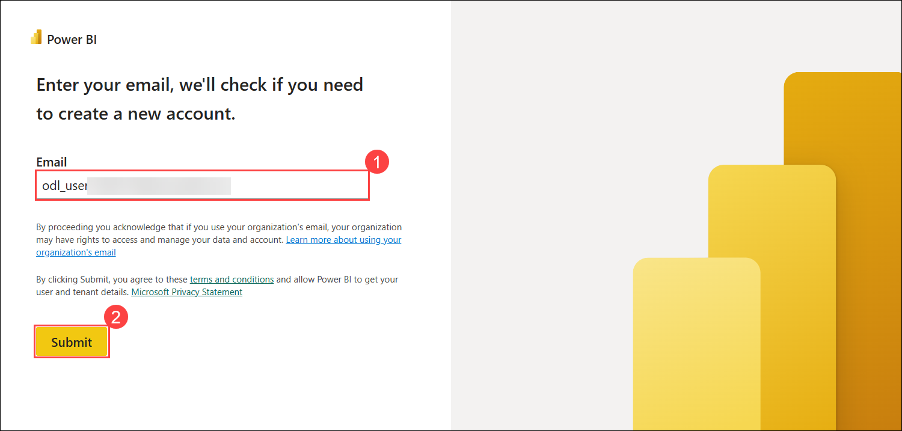
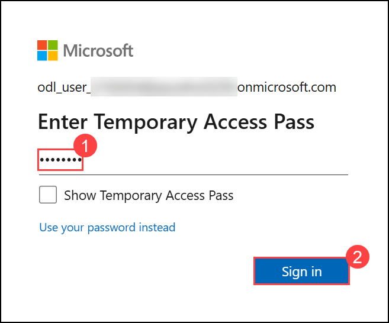

# Board-Ready Dashboard Challenge (L300: Advanced)

### Overall Estimated Duration: 4 Hours

## 📘 Lab Scenario

You work as a **Data Analyst at Contoso Ltd.**, a retail company that sells in many countries. In two weeks, the leadership team will meet to review the company's sales. The CFO has asked you to build **one dashboard** that shows how the business is doing.

This lab is a little different. You will **not** get click-by-click steps. Instead, you get the business needs and the raw data. You decide how to build the dashboard, just like a real analyst does at work.

Here is what you need to know about the data and the users:

- Contoso sells products in **many regions and countries**.
- Each region has its own **sales target** set by the finance team.
- **Regional managers should only see their own region's data**, not other regions.
- The leadership team wants a **short AI-written summary** so they can read the dashboard quickly.

You finish the lab when your dashboard is good enough to show the CFO with no more changes needed.

## 📖 Overview

In this lab, you will build a **Sales Performance dashboard** from start to finish using Power BI. You will start by loading raw CSV files into **Power BI Desktop** and connecting the tables using a **star schema**, which is a simple and clean way to organize data. Next, you will write **DAX formulas** to calculate revenue, margin, and target values, and add **charts, cards, and slicers** to make the dashboard interactive. Once the dashboard works, you will turn on **Row-Level Security** so each regional manager only sees their own data, use **Power BI Copilot** to write an AI summary of the numbers, and add a **Bullet Chart** from AppSource to compare revenue against target. Finally, you will **publish** the report to Microsoft Fabric and **export** it as a PDF. By the end, you will know the full process a real BI team follows to deliver a report to leadership.

The lab is split into two challenges:

| Challenge | Focus | What you deliver |
|-----------|-------|------------------|
| **Challenge 1 - Build the Dashboard** | Model, DAX, visuals, theme | A working single-page dashboard with 3 KPIs, 2 charts, and 1 slicer, styled in a dark theme. |
| **Challenge 2 - Stretch Goals & Submission** | RLS, Copilot, custom visual, publish | A hardened, enriched, and published report plus a PDF export scored against the rubric. |

## 🎯 Objectives

After finishing this lab, you will be able to:

- **Build a data model:** Load CSV files, link them together in a **star schema**, and set up a date table so time-based visuals work correctly.

- **Write DAX formulas:** Create the four key business measures - **Total Revenue**, **Gross Margin %**, **Target Attainment %**, and **Total Target** - using simple DAX functions like `SUM`, `SUMX`, and `DIVIDE`.

- **Design a report page:** Add **KPI cards**, a **line chart**, a **bar chart**, and a **slicer**, then apply a **dark theme** for a clean look.

- **Set up Row-Level Security:** Create roles so each regional manager sees only their own region's data. Test the roles inside Power BI Desktop before publishing.

- **Use Copilot to write a summary:** Ask Power BI Copilot to describe how the regions are performing, and add the answer to the dashboard as a text box.

- **Add a custom visual:** Download the **Bullet Chart by OKVIZ** from Microsoft AppSource and use it to compare **actual revenue against the target**.

- **Publish and share:** Publish the report to a **Microsoft Fabric workspace** and export it as a **PDF** so leadership can read it offline.

- **Self-check your work:** Use the built-in rubric at the end of Challenge 2 to make sure every part of the dashboard is complete and correct.

## ⚙️ Prerequisites

Before you start the lab, you should have:

- **Basic Power BI knowledge:** You know what a table, a measure, and a chart are. This lab shows you *how to put them together*, not what they mean.
- **The lab virtual machine (VM):** It already has **Power BI Desktop** and **Visual Studio Code** installed for you.
- **The sample data:** Seven CSV files are already saved at `C:\LabFiles\data` on the VM. You do not need to download anything.
- **A lab Power BI account:** The lab gives you a special account that has **Copilot** turned on and access to a **Microsoft Fabric workspace**.
- **Internet access** from the VM to Power BI, Microsoft Fabric, Copilot, and AppSource.
- **Some data basics:** It helps if you know what a *fact table* and a *dimension table* are, and how tables are linked together.
- **An analyst mindset:** This lab does not give you every step. You will read the requirements, make choices, and build the solution yourself.

## 🏗️ Architecture

The lab moves your work from your local computer to the cloud in a simple flow. You start on the lab VM, where the raw CSV files live, and open them in **Power BI Desktop** to build the data model, DAX measures, visuals, theme, and security roles. You also download the **Bullet Chart** from **Microsoft AppSource** and add it to the report. When the file is ready, you send it to a **Microsoft Fabric workspace**, which splits it into two parts - the **data model** and the **report**. In the cloud, **Copilot** writes an AI summary and **Row-Level Security** starts filtering data based on who is viewing it. Leadership can then view the report in the browser or read it as an **exported PDF**.

## 🖼️ Architecture Diagram


## 🔍 Explanation of Components

The architecture for this lab involves the following key components:

- **CSV Files (`C:\LabFiles\data`):** The seven raw data files (customers, products, dates, regions, sales reps, budget, sales). All your numbers come from here.

- **Visual Studio Code:** A simple text editor. You use it to open a CSV file and take a quick look before importing.

- **Power BI Desktop:** The main app you work in. You build the data model, write DAX, design visuals, apply the theme, and set up security here.

- **Microsoft Fabric Workspace:** The cloud location where your report lives after you publish it. This is where security actually takes effect.

- **Semantic Model:** The data and DAX part of your report, stored in the cloud after you publish.

- **Published Report:** The version of your dashboard people open in a web browser.

- **Power BI Copilot:** An AI helper that reads your data and writes a short summary in plain English.

- **Exported PDF:** A saved copy of the report you can email or print - useful when someone wants to read it offline.

## 🚀 Getting Started with the Lab

Welcome to your **Board-Ready Dashboard Challenge**! We've prepared a seamless environment for you to explore and learn about Power BI, DAX modeling, Row-Level Security, Copilot, and Microsoft Fabric. Let's begin by making the most of this experience:

## Accessing Your Lab Environment
 
Once you're ready to dive in, your virtual machine and **Guide** will be right at your fingertips within your web browser.


## Virtual Machine & Lab Guide

Your virtual machine is your workhorse throughout the workshop. The guide is your roadmap to success.


## Exploring Your Lab Resources

To get a better understanding of your lab resources and credentials, navigate to the **Environment** tab.


## Managing Your Virtual Machine
Feel free to **start, restart, or stop (2)** your virtual machine as needed from the **Resources (1)** tab. Your experience is in your hands!


## Lab Guide Zoom In/Zoom Out

To adjust the zoom level for the environment page, click the **A↕ : 100%** icon located next to the timer in the lab environment.


## Utilizing the Split Window Feature

For convenience, you can open the lab guide in a separate window by selecting the **Split Window** button from the top right corner.


## Resize the Virtual Machine View

Use the **slider (three vertical dots)** located between the **Virtual Machine** and the **Lab Guide** panes to adjust the display size, allowing you to customize the layout based on your preference.


## Let's Get Started with Power BI Service
 
1. On your virtual machine, click on the **Microsoft Edge** icon.

1. Navigate to Fabric portal by using the below link.

    ```
    https://app.powerbi.com/
    ```

1. On the **Sign in** page, enter the following email and click **Submit (2)**.

   - **Email: (1)** <inject key="AzureAdUserEmail"></inject>

     

1. On the **Temporary Access Pass** screen, enter the following password and click **Sign in (2)**.

   - **Temporary Access Pass: (1)** <inject key="AzureAdUserPassword"></inject>

     

     
1. When prompted with **Stay signed in?**, click **Yes**.

   

## 📞 Support Contact

The CloudLabs support team is available 24/7, 365 days a year, via email and live chat to ensure seamless assistance at any time. We offer dedicated support channels tailored specifically for both learners and instructors, ensuring that all your needs are promptly and efficiently addressed.

Learner Support Contacts:

- Email Support: cloudlabs-support@spektrasystems.com
- Live Chat Support: https://cloudlabs.ai/labs-support

Click **Next >>** from the bottom right corner to embark on your Lab journey!


### Happy Learning!!
