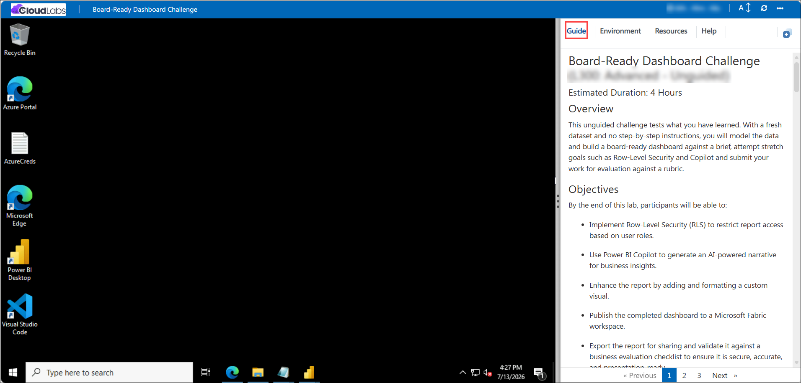
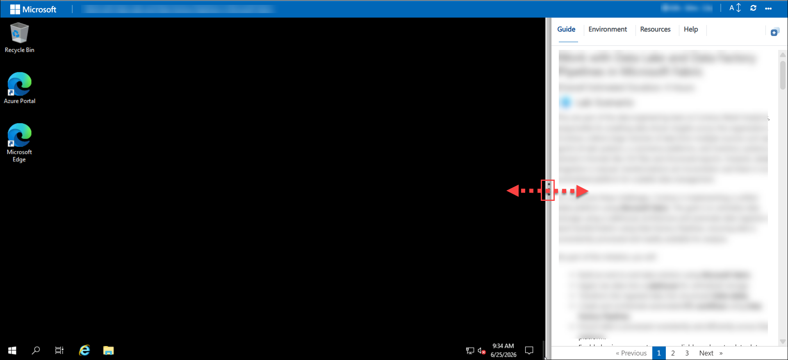
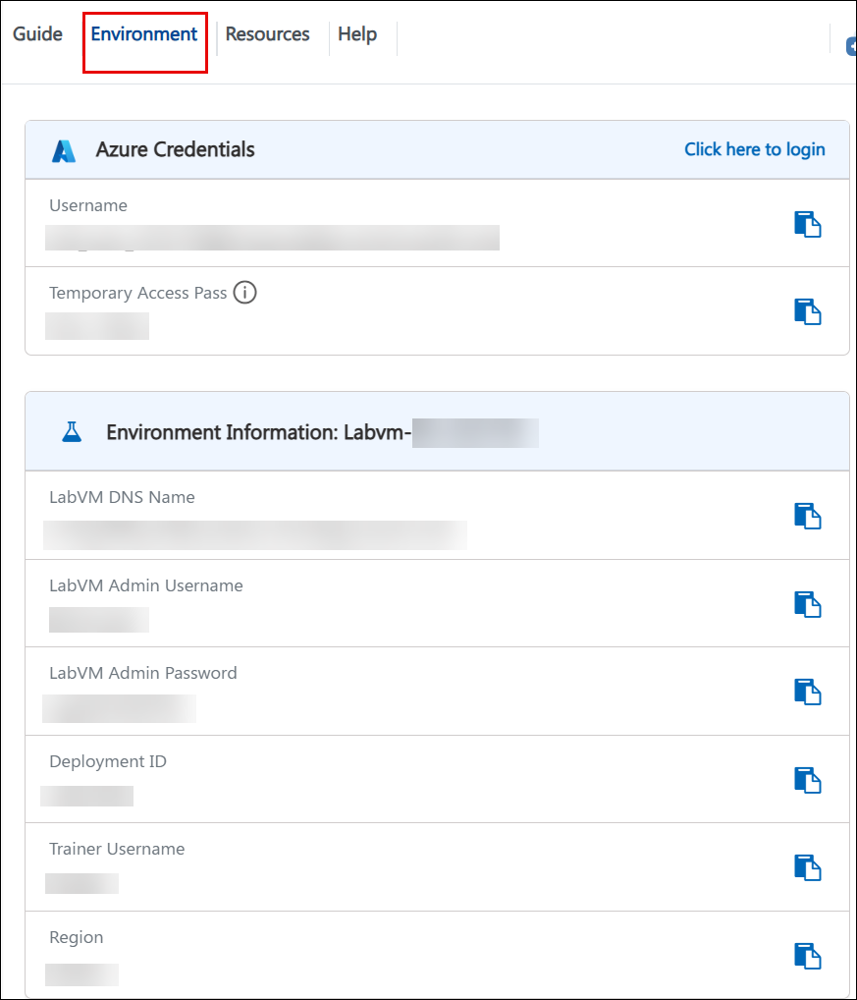
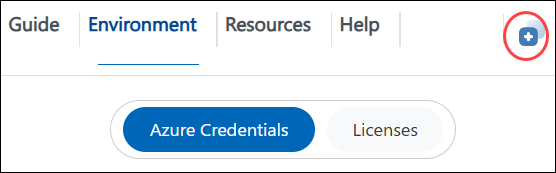
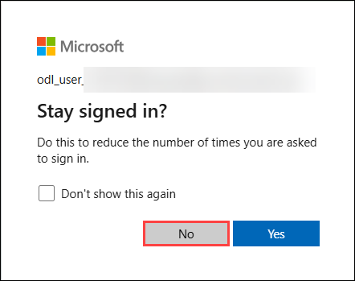

# Board-Ready Dashboard Challenge (L300: Advanced)

### Overall Estimated Duration: 4 Hours

## 📘 Lab Scenario 

You are a Business Intelligence Analyst at a growing retail organization. The sales leadership team has requested a board-ready dashboard ahead of the quarterly review, but this time you are not given step-by-step instructions, only a business brief and a fresh dataset. You must independently model the data, secure it appropriately for different stakeholders, enrich it with AI-powered insights, and publish a polished report that leadership can trust and act on.

## 📖 Overview 
 
The purpose of this lab is to test what you have learned across the workshop through an unguided challenge: with a fresh dataset and no step-by-step instructions, you will independently model the data, build a board-ready dashboard against a business brief, attempt stretch goals such as implementing Row-Level Security to control data access by role and using Power BI Copilot to generate AI-powered narrative insights, publish your report to a Microsoft Fabric workspace, and submit your work for evaluation against a rubric that checks for security, accuracy, and presentation quality — the same standard expected of a report heading to the boardroom.

## 🎯 Objectives

By the end of this lab, participants will be able to:

- Implement Row-Level Security (RLS) to govern report access according to defined user roles.

- Leverage Power BI Copilot to generate AI-driven narratives that surface key business insights.

- Enhance report presentation through the addition and formatting of a custom visual.

- Publish the finalized dashboard to a Microsoft Fabric workspace for organizational access.

- Export the report for distribution and validate it against a business evaluation checklist to confirm it is secure, accurate, and presentation-ready.

## ⚙️ Pre-requisites

Participants should have:

- A completed Sales Performance Power BI report.
Power BI Desktop installed.

- A lab-provided Power BI account with access to Copilot.

- Access to a Microsoft Fabric workspace with permission to publish reports.

- An active internet connection to access Power BI Service, Copilot, and AppSource.

## 🔍 Explanation of Components

The architecture for this lab involves the following key components:

- **A completed Sales Performance Power BI report :** You need an existing report (built in earlier labs) as your starting point, since this lab builds on top of it rather than starting from a blank canvas.

- **Power BI Desktop installed :** The desktop application is required to do the actual data modeling, report building, and RLS configuration locally before publishing.

- **A lab-provided Power BI account with access to Copilot :** Copilot features require licensing/entitlement; the lab account is pre-configured so you can use the AI narrative generation objective.

- **Access to a Microsoft Fabric workspace with permission to publish reports :** You need a workspace destination with publish rights to complete the "publish the dashboard" objective a viewer-only role wouldn't be sufficient.

## 🚀 Getting Started with Lab
Once you're ready to dive in, your virtual machine and **Guide** will be right at your fingertips within your web browser.

## Accessing Your Lab Environment
 
Once you're ready to dive in, your virtual machine and **Guide** will be right at your fingertips within your web browser.

## Virtual Machine & Lab Guide
Your virtual machine is your workhorse throughout the workshop. The guide is your roadmap to success.

## Lab Guide Zoom In/Zoom Out

To adjust the zoom level for the environment page, click the **A↕ : 100%** icon located next to the timer in the lab environment.

## Resize the Virtual Machine View

Use the **slider (three vertical dots)** located between the **Virtual Machine** and the **Lab Guide** panes to adjust the display size, allowing you to customize the layout based on your preference.

## Exploring Your Lab Resources
To get a better understanding of your lab resources and credentials, navigate to the **Environment** tab.

## Utilizing the Split Window Feature
For convenience, you can open the lab guide in a separate window by selecting the **Split Window** button from the top right corner.

## Managing Your Virtual Machine
Feel free to **start, restart, or stop (2)** your virtual machine as needed from the **Resources (1)** tab. Your experience is in your hands!

## Let's Get Started with Azure Portal
 
1. On your virtual machine, click on the **Azure Portal** icon.

    

1. On the **Sign in to Microsoft Azure** tab, you will see the login screen. Enter the following email/username, and click on **Next (2)**. 

   * **Email/Username**: <inject key="AzureAdUserEmail"></inject> **(1)**
   
       
     
1. Now enter the following Temparory Access Pass and click on **Sign in (2)**.
   
   * **Temporaray Access Pass**: <inject key="AzureAdUserPassword"></inject> **(1)**

      
     
1. If you see the pop-up **Stay Signed in?**, select **No**.

   

1. If a **Welcome to Microsoft Azure** popup window appears, select **Cancel** to skip the tour.

## 📞 Support Contact

The CloudLabs support team is available 24/7, 365 days a year, via email and live chat to ensure seamless assistance at any time. We offer dedicated support channels tailored specifically for both learners and instructors, ensuring that all your needs are promptly and efficiently addressed.

Learner Support Contacts:

- Email Support: cloudlabs-support@spektrasystems.com
- Live Chat Support: https://cloudlabs.ai/labs-support

Click **Next >>** from the bottom right corner to embark on your Lab journey!

### Happy Learning!!
