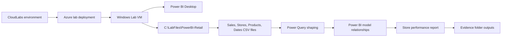

# Getting Started: Build Your First Store Performance Report in Power BI Desktop

## Scenario

You are a new business analyst for a fictional retail chain. Your manager has provided four CSV files that describe sales transactions, store details, product information, and dates. In this lab, you will use Power BI Desktop on a Windows Lab VM to load the CSV files, shape the data, create a simple model, build a one-page store performance dashboard, and write your first beginner DAX measures.

The finished report will help answer common retail questions, such as which stores sell the most, how sales trend over time, which product categories perform best, and how slicers or drill-down interactions change the view of the data.

## Lab VM and sign-in context

This lab runs on a dedicated Windows Lab VM that is provisioned for you. The deployment creates the VM, installs or verifies Power BI Desktop, and places the required local lab assets in a known folder before you begin.

1. If your CloudLabs environment provides a **Launch VM** or **Connect** button, use it to open the Windows Lab VM session.
2. If you need to sign in to the Azure portal during the lab, browse to <https://portal.azure.com> and use the following credentials:
   - Username: `<inject key="AzureAdUserEmail"></inject>`
   - Password: `<inject key="AzureAdUserPassword"></inject>`
3. Your Azure subscription for this lab is `<inject key="SubscriptionID"></inject>` and your tenant is `<inject key="TenantID"></inject>`.
4. Your lab deployment identifier is part of the resource name **PowerBI-Retail-<inject key="DeploymentID" enableCopy="false"/>**. You may see this identifier in CloudLabs or Azure resource names if you inspect the deployment.

> [!Important]
> The Power BI work in this lab is completed locally in Power BI Desktop. You do not need to publish to the Power BI service, create Azure data services, or use Power BI administrator permissions.

## Lab overview

You will work with the following local folder on the Windows Lab VM:

```text
C:\LabFiles\PowerBI-Retail
```

The folder contains the retail source data files:

```text
C:\LabFiles\PowerBI-Retail\Sales.csv
C:\LabFiles\PowerBI-Retail\Stores.csv
C:\LabFiles\PowerBI-Retail\Products.csv
C:\LabFiles\PowerBI-Retail\Dates.csv
```

It also contains an evidence folder used for saved report files and validation outputs:

```text
C:\LabFiles\PowerBI-Retail\Evidence
```

By the end of the lab, you should have these learner-created files in the evidence folder:

```text
C:\LabFiles\PowerBI-Retail\Evidence\StorePerformanceReport.pbix
C:\LabFiles\PowerBI-Retail\Evidence\DAXMeasures.txt
C:\LabFiles\PowerBI-Retail\Evidence\StorePerformanceReport.png
```

A PDF or JPG export is also acceptable for the final report evidence if your environment uses one of those formats:

```text
C:\LabFiles\PowerBI-Retail\Evidence\StorePerformanceReport.pdf
C:\LabFiles\PowerBI-Retail\Evidence\StorePerformanceReport.jpg
```

## Objectives

After completing this lab, you will be able to:

- Launch Power BI Desktop on a prepared Windows Lab VM.
- Connect Power BI Desktop to local CSV files by using **Get data** > **Text/CSV**.
- Use Power Query Editor to review, clean, rename, type, and shape source columns.
- Load shaped queries into the Power BI Desktop model.
- Create or verify relationships between a sales fact table and store, product, and date tables.
- Build a single-page store performance report with cards, charts, slicers, filters, and basic interactions.
- Create simple DAX measures such as `Total Sales`, `Total Units`, and `% of Total Sales`.
- Save the PBIX file, DAX measure definitions, and report screenshot or export in the required evidence folder.

## Prerequisites

You should be comfortable with basic Windows tasks such as opening File Explorer, launching desktop applications, browsing folders, and saving files. No previous Power BI experience is required.

Optional Power BI service sign-in may be available if your organization provides it, but the core lab does not require publishing. If Power BI Desktop asks you to sign in and you do not have a Power BI service account for this lab, close or skip the prompt when the UI allows it and continue working in Power BI Desktop.

## Architecture

The lab uses a simple local-file architecture. Azure provides the disposable Windows Lab VM. Power BI Desktop and the CSV source files are prepared on the VM, and all learner-created evidence is saved locally.



## 🚀 Getting Started with the Lab

Welcome to the **Publish, Share, and Enhance User Experience in Power BI** hands-on lab! We've prepared a seamless environment for you to explore and learn about publishing, sharing, and enhancing Power BI content. Let's begin by making the most of this experience.

## 🖥️ Accessing Your Lab Environment

Once you're ready to dive in, your virtual machine and lab guide will be right at your fingertips within your web browser.


## 🧭 Exploring Your Lab Resources

To get a better understanding of your lab resources and credentials, navigate to the **Environment** tab.


## 🛠️ Utilizing the Split Window Feature

For convenience, you can open the lab guide in a separate window by selecting the **Split Window** button from the top right corner.


## ⚙️ Managing Your Virtual Machine

Feel free to **start, stop, or restart (2)** your virtual machine as needed from the **Resources (1)** tab. Your experience is in your hands!


## 📖 Lab Guide Zoom In/Zoom Out

To adjust the zoom level for the environment page, click the **A↕ : 100%** icon located next to the timer in the lab environment.


## Resize the Virtual Machine View

Use the **slider (three vertical dots)** located between the **Virtual Machine** and the **Lab Guide** panes to adjust the display size, allowing you to customize the layout based on your preference.


## 🔑 Let's Get Started with the Power BI Service

1. On the Lab VM, open **Microsoft Edge** from the desktop. In a new tab, navigate to **Microsoft Fabric** by copying and pasting the following URL into the address bar:

   ```
   https://app.powerbi.com/
   ```
   
1. On the **Sign in** page, enter the following email and click **Submit (2)**.

   - **Email: (1)** <inject key="AzureAdUserEmail"></inject>

     

1. On the **Enter password** screen, enter the following password and click **Sign in (2)**.

   - **Password: (1)** <inject key="AzureAdUserPassword"></inject>

     

1. When prompted with **Stay signed in?**, click **Yes**.

   

   > **Note**: If you receive a welcome tour pop-up, click **Cancel** or **Skip** to continue.

1. From the Power BI home page, select **Account Manager (1)** from the top-right corner and click **Start trial (2)** to activate the Microsoft Fabric trial.

   

   > **Note:** The trial is enabled to ensure that your account has access to Power BI Pro and Fabric features, including sharing and Copilot experiences used later in this lab.

1. On the **Activate your 60-day fabric trial capacity** window, click **Activate**.

   

1. On the **Successfully upgraded to Microsoft Fabric** window, click **OK** to continue.

   

1. Click the **Account manager (1)** icon again and, under the **Profile** section, verify that the **Trial Status (2)** shows the number of days remaining.

   

1. Keep this browser session signed in — you will return to the Power BI Service after publishing your report from Power BI Desktop.

## Lab Support

If you need any assistance at any point during the lab, please contact us at **cloudlabs-support@spektrasystems.com**. We are available 24/7 to help you out.

Learner Support Contacts:

- Email Support: cloudlabs-support@spektrasystems.com
- Live Chat Support: https://cloudlabs.ai/labs-support

Now, click on **Next** from the lower right corner to move on to the next page.


### Happy Learning!!