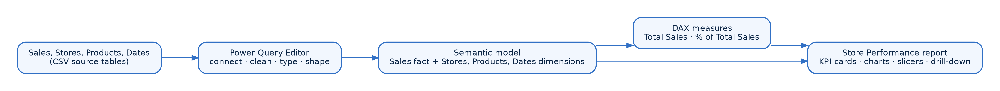
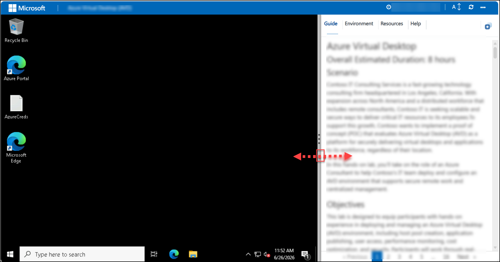
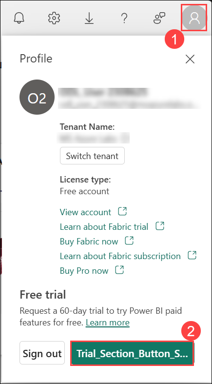

# Getting Started: Build Your First Store Performance Report in Power BI Desktop

### Overall Estimated Duration: 4 Hours

## Lab Scenario
 
You are a new business analyst for **Contoso Retail**, a fictional retail chain with stores across the United States. Contoso's leadership wants a single-page report that answers everyday retail questions: which stores sell the most, how sales trend over time, which product categories perform best, and how slicers or drill-down change the view.

## Lab Overview

In this lab you will use **Power BI Desktop** on a Windows Lab VM to connect to four CSV files hosted in Azure Blob Storage — `Sales`, `Stores`, `Products`, and `Dates`. You will shape the data in Power Query, model the relationships, build an interactive **Store Performance** report, and add your first DAX measures. You will also sign in to the Power BI service so you can publish the report and continue with follow-on lab work.
 
## Objectives
 
After completing this lab you will be able to:
 
- Sign in to the Power BI service and confirm Power BI Desktop is installed on a prepared Windows Lab VM.
- Connect Power BI Desktop to CSV files hosted in Azure Blob Storage using the **Web** connector with anonymous authentication.
- Use Power Query Editor to review, clean, rename, type, and shape source columns.
- Load shaped queries into the Power BI Desktop semantic model and verify relationships between tables.
- Build a single-page Store Performance report with KPI cards, charts, a table, a map, slicers, filters, drill-down, and cross-filtering.
- Create beginner DAX measures such as `Total Sales` and `% of Total Sales`.
- Save the PBIX file, DAX definitions, and report screenshot or export in the required Evidence folder on the Lab VM.

## Prerequisites
 
- Familiarity with basic Windows tasks — File Explorer, launching desktop applications, saving files.
- An Azure Active Directory account with a Power BI license (provided by CloudLabs and injected on the sign-in steps later on this page).
- No prior Power BI, DAX, or Power Query experience required — the lab builds up from a blank Power BI Desktop canvas.

## Architecture
 
The lab builds a small Power BI solution end-to-end. You start with four CSV source tables, shape them in Power Query, build a semantic model with relationships (a classic star schema), add DAX measures, and design an interactive report — all inside Power BI Desktop.
 

 
### Component details
 
| Component | Purpose |
|---|---|
| Source tables (`Sales`, `Stores`, `Products`, `Dates`) | The retail scenario dataset. `Sales` is the fact table with one row per transaction; `Stores`, `Products`, and `Dates` are dimensions. |
| Power Query Editor | Where you connect to the source, review the data, correct data types, standardize inconsistent values, remove blank or error rows, and add calculated columns before loading into the model. |
| Semantic model | The shaped tables plus the relationships between them — a classic star schema with `Sales` at the center and `Stores`, `Products`, `Dates` around it. |
| Relationships | Three one-to-many links: `Stores` → `Sales`, `Products` → `Sales`, `Dates` → `Sales`. Cross-filter direction is Single. |
| DAX measures | Explicit measures written on the model. `Total Sales` sums `SalesAmount`; `% of Total Sales` returns each row's contribution to the grand total using `DIVIDE` and `ALL`. |
| Store Performance report | A single interactive page with KPI cards (Total Sales, Total Units, Top Store), a bar chart, line chart, table, and map, plus slicers, a page-level filter, drill-down on the line chart, and cross-filtering between visuals. |
## 🚀 Getting Started with the Lab

Welcome to the **Publish, Share, and Enhance User Experience in Power BI** hands-on lab! We've prepared a seamless environment for you to explore and learn about publishing, sharing, and enhancing Power BI content. Let's begin by making the most of this experience.

## 🖥️ Accessing Your Lab Environment

Once you're ready to dive in, your virtual machine and lab guide will be right at your fingertips within your web browser.


## 🧭 Exploring Your Lab Resources

To get a better understanding of your lab resources and credentials, navigate to the **Environment** tab.


## 🛠️ Utilizing the Split Window Feature

For convenience, you can open the lab guide in a separate window by selecting the **Split Window** button from the top right corner.


## ⚙️ Managing Your Virtual Machine

Feel free to **start, stop, or restart (2)** your virtual machine as needed from the **Resources (1)** tab. Your experience is in your hands!


## 📖 Lab Guide Zoom In/Zoom Out

To adjust the zoom level for the environment page, click the **A↕ : 100%** icon located next to the timer in the lab environment.


## Resize the Virtual Machine View

Use the **slider (three vertical dots)** located between the **Virtual Machine** and the **Lab Guide** panes to adjust the display size, allowing you to customize the layout based on your preference.



## 🔑 Let's Get Started with the Power BI Service

1. On the Lab VM, open **Microsoft Edge** from the desktop. In a new tab, navigate to **Microsoft Fabric** by copying and pasting the following URL into the address bar:

   ```
   https://app.powerbi.com/
   ```
   
1. On the **Sign in** page, enter the following email and click **Submit (2)**.

   - **Email: (1)** <inject key="AzureAdUserEmail"></inject>

     

1. On the **Enter password** screen, enter the following password and click **Sign in (2)**.

   - **Password: (1)** <inject key="AzureAdUserPassword"></inject>

     

1. When prompted with **Stay signed in?**, click **Yes**.

   

   > **Note**: If you receive a welcome tour pop-up, click **Cancel** or **Skip** to continue.

1. From the Power BI home page, select **Account Manager (1)** from the top-right corner and click **Trial_Selection_Button_S (2)** to activate the Microsoft Fabric trial.

   

   > **Note:** The trial is enabled to ensure that your account has access to Power BI Pro and Fabric features, including sharing and Copilot experiences used later in this lab.

   It may ask to the **Activate your 60-day fabric trial capacity** window, by clicking on **Activate**.

   

1. On the **Successfully upgraded to Microsoft Fabric** window, click **OK** to continue.

   

1. Click the **Account manager (1)** icon again and, under the **Profile** section, verify that the **Trial Status (2)** shows the number of days remaining.

   

1. Keep this browser session signed in — you will return to the Power BI Service after publishing your report from Power BI Desktop.

## Lab Support

If you need any assistance at any point during the lab, please contact us at **cloudlabs-support@spektrasystems.com**. We are available 24/7 to help you out.

Learner Support Contacts:

- Email Support: cloudlabs-support@spektrasystems.com
- Live Chat Support: https://cloudlabs.ai/labs-support

Now, click on **Next** from the lower right corner to move on to the next page.


### Happy Learning!!